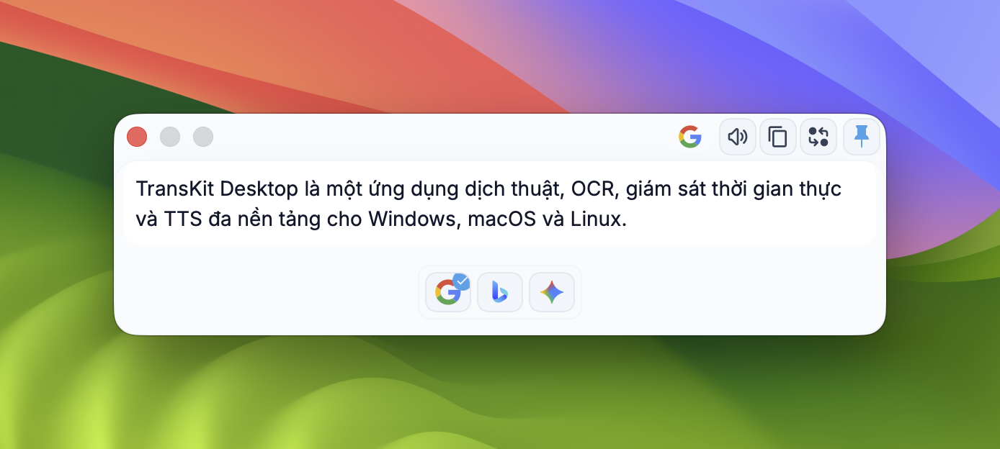
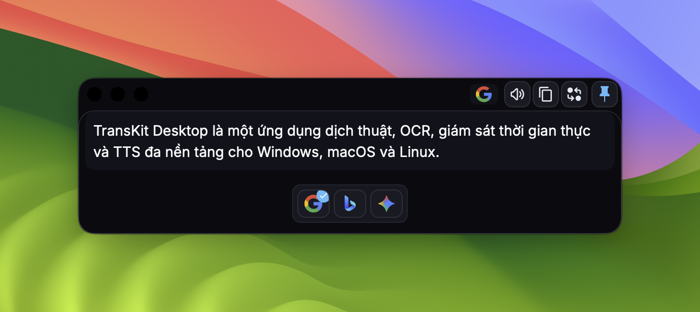
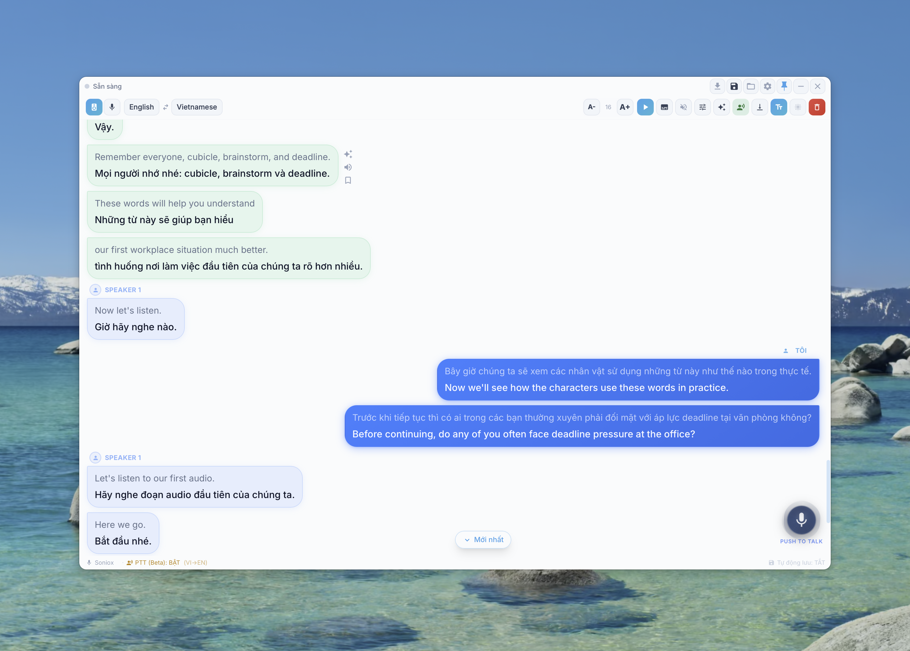
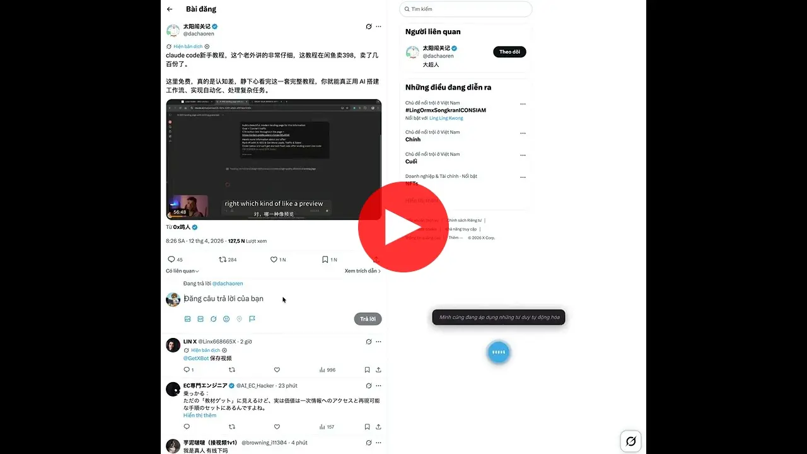
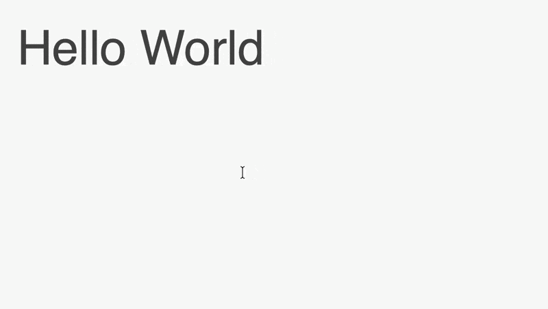
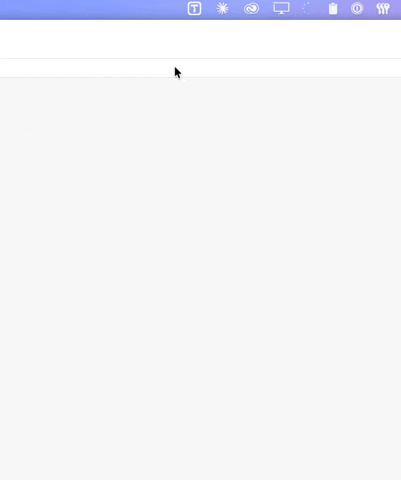
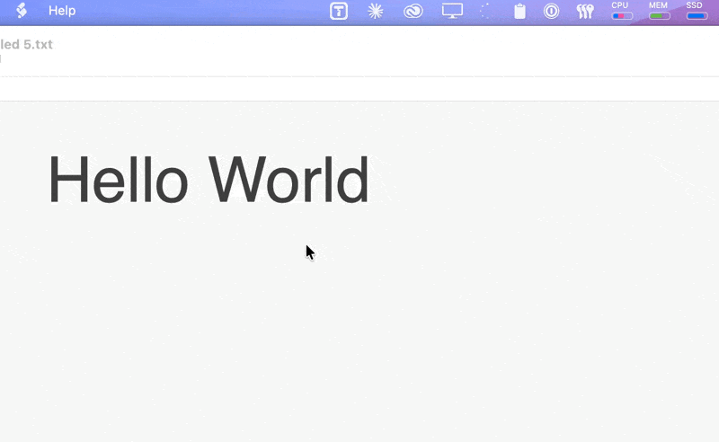
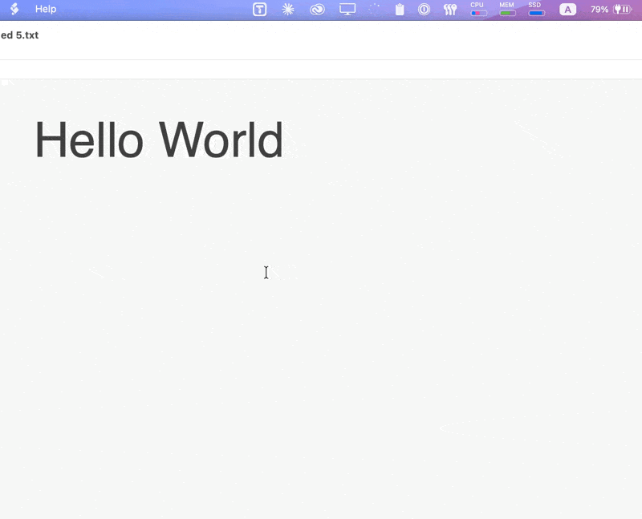
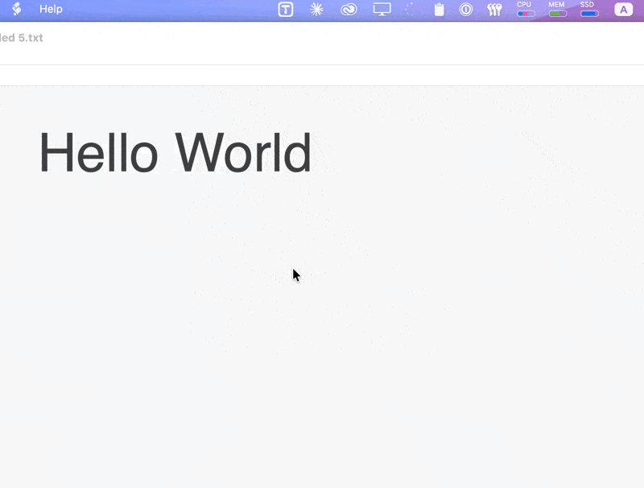

# TransKit Desktop

TransKit Desktop is a cross-platform translation, OCR, realtime monitor, and TTS app for Windows, macOS, and Linux.

<div align="center">

<h3>English | <a href='./README_VI.md'>Tiếng Việt</a> | <a href='./README_CN.md'>中文</a> | <a href='./README_KR.md'>한글</a></h3>

<table>
<tr>
    <td></td>
    <td></td>
</tr>
</table>

# Table of Contents

</div>

- [Full User Guide](./docs/user_guide.md)
- [Usage](#usage)
- [Keyboard Shortcuts](#keyboard-shortcuts)
- [What Is New In TransKit](#what-is-new-in-transkit)
- [Installation](#installation)
- [Transcription Setup (Monitor)](#transcription-setup-monitor)
- [FAQ & Troubleshooting](#faq--troubleshooting)
- [Build From Source](#build-from-source)
- [Release New Version (All Platforms)](#release-new-version-all-platforms)
- [Contributing](#contributing)
- [License](#license)

<div align="center">

# Usage

</div>


<table>
 
  <tr>
    <td colspan="3" align="center">
      <b>Live Interpreter</b><br/>
      Live Interpreter with AI suggestions, Submode, and TTS and PTT (Talking native language and listen to translated language). All services are configurable in the Service settings.<br/>
      

<b>Voice Anywhere</b><br/>
Voice input into any app or window. All services are configurable in the Service settings.<br/>
      [](https://youtu.be/Gp4wn5wb17A)
    </td>
  </tr>
</table>

<table>
  <tr>
    <th width="33%">Translation by selection</th>
    <th width="33%">Translate by input</th>
    <th width="33%">External calls</th>
  </tr>
  <tr>
    <td>Select text and press the shortcut to translate</td>
    <td>Press shortcut to open translation window, translate by hitting Enter</td>
    <td>More efficient workflow by integrating with other apps</td>
  </tr>
  <tr>
    <td></td>
    <td></td>
    <td></td>
  </tr>
   <tr>
    <th width="33%">Clipboard Listening</th>
    <th width="33%">Screenshot OCR</th>
    <th width="33%">Screenshot Translation</th>
  </tr>
  <tr>
    <td>Click the top left icon on any translation panel to start clipboard listening. Copied text will be translated automatically.</td>
    <td>Press shortcut, select area to OCR</td>
    <td>Press shortcut, select area to translate</td>
  </tr>
  <tr>
    <td></td>
    <td></td>
    <td></td>
  </tr>
</table>

## Keyboard Shortcuts

All shortcuts are **fully configurable** in **Settings → Hotkey**. The defaults below are registered automatically on a fresh install — you can reassign or clear any of them at any time.

> **Cross-platform note:** `Ctrl+Alt` on Windows / Linux is physically the same key combination as `Ctrl+Option` on macOS. The shortcut is registered once and works on all three platforms without any per-OS adjustment.

| Feature | Default Shortcut | Description |
|---|---|---|
| **Voice Anywhere** | `Ctrl+Alt+V` | Show / hide the floating mic button for voice input into any app or window |
| **Realtime Translate** | `Ctrl+Alt+M` | Open the Audio Monitor for live speech-to-text + translation |
| **Selection Translate** | `Ctrl+Alt+Q` | Translate the currently selected text |
| **Input Translate** | `Ctrl+Alt+W` | Open the text-input translation window |
| **OCR Recognize** | `Ctrl+Alt+R` | Capture a screen region and extract text |
| **OCR Translate** | `Ctrl+Alt+O` | Capture a screen region and translate the text |

### Why these keys?

The `Ctrl+Alt+` prefix (`Ctrl+Option+` on macOS) was chosen because:
- Not claimed by any OS system shortcut on Windows, macOS, or Linux
- `Ctrl+Alt+Del`, `Ctrl+Alt+T` (Linux terminal), and `Ctrl+Alt+L` (Linux lock) are the only reserved combinations in this family — all avoided above
- Common developer shortcuts (`Ctrl+Shift+I`, `Ctrl+Shift+R`, `Ctrl+\``) that would conflict with browsers and IDEs are not used
- Single-hand press is still comfortable with the left hand on `Ctrl+Alt` and a letter key

You can freely reassign any shortcut in **Settings → Hotkey**, or clear a field (Backspace) to disable it.

## What Is New In TransKit

Compared to upstream Pot, TransKit extends realtime and AI workflows.

### Realtime Monitor

Implemented in [`src/window/Monitor/index.jsx`](./src/window/Monitor/index.jsx) and related components.

- Realtime meeting monitor with low-latency speech-to-text and translation
- Sub Mode (subtitle-style overlay)
- AI context generation and AI suggestion per transcript entry
- Bookmark timeline for important lines
- Auto-save transcript to Markdown files
- Quick open for saved transcript file/folder

### TTS (Free + Premium, BYO API)

- Free-friendly: Edge TTS, Google TTS
- Premium: ElevenLabs, OpenAI-compatible TTS
- Self-host option: VieNeu streaming TTS
- BYO API key per user in app settings

## Installation

Release page: <https://github.com/transkit-app/transkit-desktop/releases/latest>

### Windows

1. Download the latest `.exe` installer from [Releases](https://github.com/transkit-app/transkit-desktop/releases/latest).
2. Choose package by architecture:
   - x64: `TransKit_{version}_x64-setup.exe`
   - x86: `TransKit_{version}_x86-setup.exe`
   - arm64: `TransKit_{version}_arm64-setup.exe`
3. Run the installer.
   > [!NOTE]
   > If Windows Defender shows a "Windows protected your PC" message, click **"More info"** and then **"Run anyway"**.

Alternatively, install via Winget:
```powershell
winget install TransKit
```

### macOS

Install via Homebrew:
```bash
brew tap transkit-app/tap
brew install --cask transkit
```
Alternatively 
1. Download the latest `.dmg` from the [Releases page](https://github.com/transkit-app/transkit-desktop/releases/latest).
2. Open the `.dmg` and drag **TransKit** to Applications.
3. **Important** — the app is not yet signed with an Apple Developer certificate. macOS will block it on first open. Run this command **once** in Terminal to allow it:
   ```bash
   xattr -cr /Applications/TransKit.app
   ```
4. On first launch, macOS will ask for **Screen & System Audio Recording** permissions. Toggle them **ON** in System Settings for TransKit to capture system audio.


### Linux

1. Download the package for your architecture from [Releases](https://github.com/transkit-app/transkit-desktop/releases/latest).
2. Available package formats:
   - `.deb` (Ubuntu/Debian)
   - `.rpm` (Fedora/RHEL)
   - `.AppImage` (Universal)

---

## Transcription Setup (Monitor)

While basic translation features (Selection/Input/OCR) work out-of-the-box, the **Realtime Monitor** requires a **Transcription** (Speech-to-Text) provider.

1. Go to **Settings > Service > Transcription**.
2. Add a provider and enter your API Key. Supported providers include:
   - **Soniox** (Recommended for low latency) - [Get API Key](https://soniox.com/) require credit
   - **Deepgram** - [Get API Key](https://console.deepgram.com/) free signup, get $200 credit
   - **AssemblyAI** - [Get API Key](https://www.assemblyai.com/) 
   - **Gladia** - [Get API Key](https://www.gladia.io/) free signup, get free 10 hours transcription credit/month
   - **OpenAI Whisper** - [Get API Key](https://platform.openai.com/)
3. Go to **Settings > Hotkey** and set a shortcut for **Audio Monitor**.

## FAQ & Troubleshooting

### Why is the translation window not appearing?
- Check if the hotkey is registered correctly in **Settings > Hotkey**.
- Ensure there are no hotkey conflicts with other applications.

### Monitor status shows "Error"?
- Verify your Internet connection.
- Check if your API key for the Transcription provider is correct and has a balance.

### No audio captured on macOS?
- Go to **System Settings > Privacy & Security**.
- Ensure TransKit has permissions for **Microphone** and **Screen Recording** (required for capturing system audio).

## Build From Source

### Requirements

- Node.js 20+
- pnpm 9+
- Rust stable

### Commands

```bash
pnpm install
pnpm tauri dev
pnpm tauri build
```

> [!TIP]
> **For Developers Building from Source**: If you want to disable Transkit Cloud features (Auth, Trial keys), copy `.env.example` to `.env` and set `VITE_DISABLE_CLOUD=true` before building.

## Release New Version (All Platforms)

TransKit uses CI workflow: [`.github/workflows/package.yml`](./.github/workflows/package.yml)

1. Update [`CHANGELOG`](./CHANGELOG).
2. Create tag:

```bash
git tag v3.1.0
git push origin v3.1.0
```

3. GitHub Actions builds and publishes:
   - macOS: `aarch64`, `x86_64`
   - Windows: `x64`, `x86`, `arm64` (+ fix-runtime variants)
   - Linux: `x86_64`, `i686`, `aarch64`, `armv7`

Required release secrets include `TAURI_PRIVATE_KEY`, `TAURI_KEY_PASSWORD`, and Apple signing/notarization secrets for macOS jobs.

Updater scripts/docs: [`updater/README.md`](./updater/README.md)

## Contributing

1. Fork repo and create a feature branch.
2. Keep changes focused and add tests/checks when applicable.
3. Run local checks/build before PR:

```bash
pnpm install
pnpm tauri dev
pnpm tauri build
```

4. Open a Pull Request with:
   - clear summary
   - screenshots/GIFs for UI changes
   - migration notes if config keys are changed

## Credits

This project was originally forked from [Pot Desktop](https://github.com/pot-app/pot-desktop).

Significant improvements and modifications have been made.

## License

GPL-3.0-only. See [`LICENSE`](./LICENSE).
