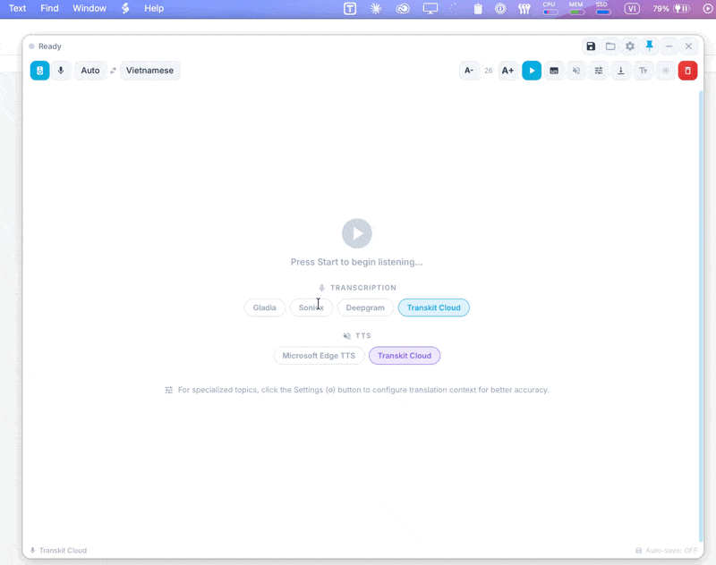
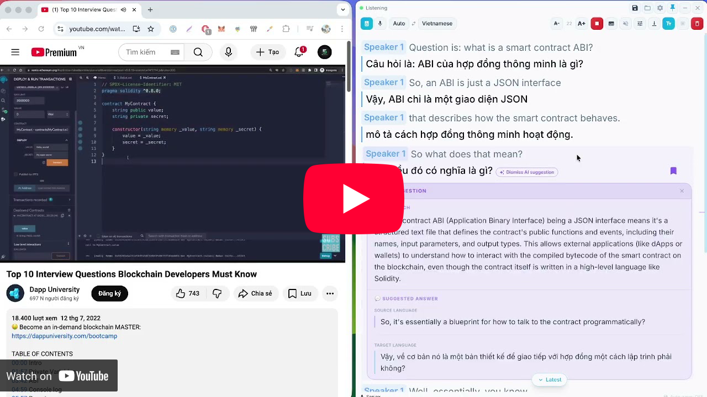

# TransKit Desktop

TransKit Desktop là ứng dụng dịch thuật, OCR, realtime monitor và TTS đa nền tảng cho Windows, macOS và Linux.

Dự án là bản fork từ [Pot Desktop](https://github.com/pot-app/pot-desktop), phát hành theo GPL-3.0-only.

<div align="center">

<h3><a href='./README.md'>English</a> | Tiếng Việt | <a href='./README_CN.md'>中文</a> | <a href='./README_KR.md'>한글</a></h3>

<table>
<tr>
    <td></td>
    <td></td>
</tr>
</table>


# Mục lục

</div>

- [Hướng dẫn sử dụng đầy đủ](./docs/user_guide_vi.md)
- [Usage](#usage)
- [Điểm Mới Trên TransKit](#điểm-mới-trên-transkit)
- [Cài Đặt](#cài-đặt)
- [Cấu hình Phiên âm (Monitor)](#cấu-hình-phiên-âm-monitor)
- [Hỏi đáp & Xử lý sự cố](#hỏi-đáp--xử-lý-sự-cố)
- [Build Từ Source](#build-từ-source)
- [Release Version Mới (All Platforms)](#release-version-mới-all-platforms)
- [Đóng Góp](#đóng-góp)
- [Giấy phép](#giấy-phép)

<div align="center">

# Usage

</div>

| Translation by selection                        | Translate by input                                                    | External calls                                                                           |
| ----------------------------------------------- | --------------------------------------------------------------------- | ---------------------------------------------------------------------------------------- |
| Select text and press the shortcut to translate | Press shortcut to open translation window, translate by hitting Enter | More efficient workflow by integrating with other apps |
|                     |                                           |                                                              |

<table>
  <tr>
    <th width="33%">Clipboard Listening</th>
    <th width="33%">Screenshot OCR</th>
    <th width="33%">Screenshot Translation</th>
  </tr>
  <tr>
    <td>Click the top left icon on any translation panel to start clipboard listening. Copied text will be translated automatically.</td>
    <td>Press shortcut, select area to OCR</td>
    <td>Press shortcut, select area to translate</td>
  </tr>
  <tr>
    <td></td>
    <td></td>
    <td></td>
  </tr>
  <tr>
    <td colspan="3" align="center">
      <b>Realtime Audio Monitor</b><br/>
      Realtime Audio Monitor với AI suggestion, Submode và TTS. Mọi dịch vụ đều được cấu hình trong phần Service.<br/>
      

<b>Watch video demo</b>

[](https://youtu.be/a8rR6RzHokc)
    </td>
  </tr>
</table>

## Điểm Mới Trên TransKit

So với Pot gốc, TransKit mở rộng mạnh workflow realtime và AI.

### Realtime Monitor

Triển khai tại [`src/window/Monitor/index.jsx`](./src/window/Monitor/index.jsx) và các thành phần liên quan.

- Monitor realtime cho họp trực tuyến với độ trễ thấp (speech-to-text + dịch)
- Sub Mode dạng phụ đề nổi
- AI generate context và AI suggestion theo từng đoạn transcript
- Bookmark timeline cho các đoạn quan trọng
- Tự động lưu transcript dạng Markdown
- Mở nhanh file/thư mục transcript đã lưu

### TTS (Free + Premium, BYO API)

- Free-friendly: Edge TTS, Google TTS
- Premium: ElevenLabs, OpenAI-compatible TTS
- Self-host: VieNeu streaming TTS
- BYO API key theo từng người dùng trong settings

## Cài Đặt

Trang release: <https://github.com/transkit-app/transkit-desktop/releases/latest>

### Windows

1. Tải file cài đặt `.exe` mới nhất từ [Releases](https://github.com/transkit-app/transkit-desktop/releases/latest).
2. Chọn đúng kiến trúc:
   - x64: `TransKit_{version}_x64-setup.exe`
   - x86: `TransKit_{version}_x86-setup.exe`
   - arm64: `TransKit_{version}_arm64-setup.exe`
3. Chạy installer.
   > [!NOTE]
   > Nếu Windows Defender hiển thị thông báo "Windows protected your PC", hãy nhấn **"More info"** và chọn **"Run anyway"**.

Hoặc cài đặt qua Winget:
```powershell
winget install TransKit
```

### macOS

Cài đặt qua Homebrew:
```bash
brew tap transkit-app/tap
brew install --cask transkit
```
Hoặc trực tiếp:
1. Tải file `.dmg` mới nhất từ trang [Releases](https://github.com/transkit-app/transkit-desktop/releases/latest).
2. Mở file `.dmg` và kéo **TransKit** vào thư mục Applications.
3. **Quan trọng** — Ứng dụng hiện chưa được ký (sign). macOS sẽ chặn khi mở lần đầu. Hãy chạy lệnh này **một lần duy nhất** trong Terminal để cho phép ứng dụng:
   ```bash
   xattr -cr /Applications/TransKit.app
   ```
4. Khi mở lần đầu, macOS sẽ hỏi quyền **Screen & System Audio Recording**. Hãy bật **ON** trong System Settings để ứng dụng có thể bắt được âm thanh hệ thống.


### Linux

1. Tải gói theo đúng kiến trúc từ [Releases](https://github.com/transkit-app/transkit-desktop/releases/latest).
2. Các định dạng gói:
   - `.deb` (Ubuntu/Debian)
   - `.rpm` (Fedora/RHEL)
   - `.AppImage` (Phổ thông)

---

## Cấu hình Phiên âm (Monitor)

Trong khi các tính năng dịch cơ bản (Bôi đen/Nhập liệu/OCR) có thể dùng ngay sau khi cài phím tắt, tính năng **Realtime Monitor** yêu cầu bạn cấu hình dịch vụ **Phiên âm** (Speech-to-Text).

1. Vào **Cài đặt > Dịch vụ > Phiên âm**.
2. Thêm một Provider và nhập API Key của bạn. Các nhà cung cấp hỗ trợ bao gồm:
   - **Soniox** (Khuyến nghị cho độ trễ thấp) - [Lấy API Key](https://soniox.com/)
   - **Deepgram** - [Lấy API Key](https://console.deepgram.com/)
   - **AssemblyAI** - [Lấy API Key](https://www.assemblyai.com/)
   - **Gladia** - [Lấy API Key](https://www.gladia.io/)
   - **OpenAI Whisper** - [Lấy API Key](https://platform.openai.com/)
3. Vào **Cài đặt > Phím tắt** và đặt phím cho **Dịch âm thanh realtime**.

## Hỏi đáp & Xử lý sự cố

### Tại sao cửa sổ dịch không hiển thị?
- Kiểm tra lại phím tắt đã được đăng ký đúng trong **Cài đặt > Phím tắt** chưa.
- Đảm bảo phím tắt không bị xung đột với ứng dụng khác.

### Monitor báo trạng thái "Lỗi" (Error)?
- Kiểm tra kết nối Internet của bạn.
- Kiểm tra API Key của dịch vụ Phiên âm đã chính xác và còn số dư chưa.

### Không bắt được âm thanh trên macOS?
- Vào **System Settings > Privacy & Security**.
- Đảm bảo TransKit đã được cấp quyền **Microphone** và **Screen Recording** (cần thiết để bắt âm thanh hệ thống).

## Build Từ Source

### Yêu cầu

- Node.js 20+
- pnpm 9+
- Rust stable

### Lệnh

```bash
pnpm install
pnpm tauri dev
pnpm tauri build
```

> [!TIP]
> **Đối với nhà phát triển build từ Source**: Nếu bạn muốn tắt các tính năng Transkit Cloud (Xác thực, Khóa dùng thử), hãy sao chép `.env.example` sang `.env` và đặt `VITE_DISABLE_CLOUD=true` trước khi build.

## Release Version Mới (All Platforms)

TransKit dùng workflow CI: [`.github/workflows/package.yml`](./.github/workflows/package.yml)

1. Cập nhật [`CHANGELOG`](./CHANGELOG).
2. Tạo tag:

```bash
git tag v3.1.0
git push origin v3.1.0
```

3. GitHub Actions sẽ build và publish:
   - macOS: `aarch64`, `x86_64`
   - Windows: `x64`, `x86`, `arm64` (+ fix-runtime)
   - Linux: `x86_64`, `i686`, `aarch64`, `armv7`

Secrets tối thiểu cho release gồm `TAURI_PRIVATE_KEY`, `TAURI_KEY_PASSWORD`, và nhóm Apple signing/notarization cho macOS.

Tài liệu updater: [`updater/README.md`](./updater/README.md)

## Đóng Góp

1. Fork repo và tạo branch tính năng.
2. Giữ phạm vi thay đổi gọn, có test/check phù hợp.
3. Chạy build/check local trước khi mở PR:

```bash
pnpm install
pnpm tauri dev
pnpm tauri build
```

4. Mở Pull Request với:
   - mô tả thay đổi rõ ràng
   - ảnh/GIF nếu có thay đổi UI
   - ghi chú migration nếu đổi key config

## Giấy phép

GPL-3.0-only. Xem [`LICENSE`](./LICENSE).
