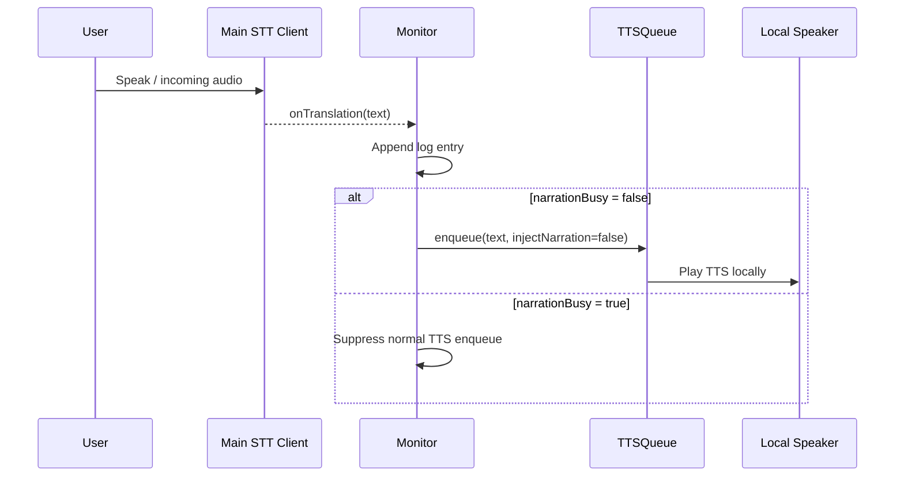
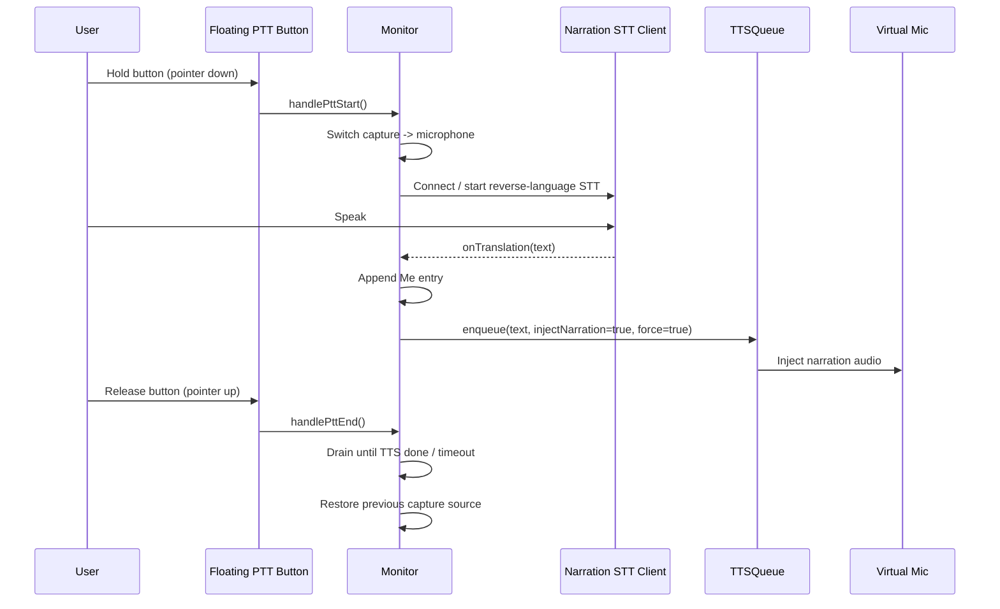
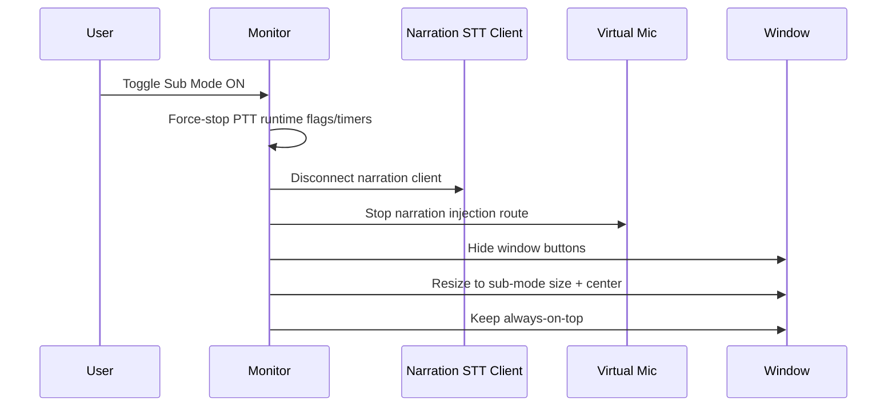

# Narration / Spoken Translation

## Status
Implemented in `Monitor` with production runtime behavior on desktop.

This document reflects the current implementation, not the original design draft.

## Goal
Narration lets the user speak in one language and send translated TTS audio into a virtual microphone for meeting apps.

High-level path:

1. User holds Push-to-Talk (PTT)
2. Audio capture switches to microphone
3. Dedicated narration STT client transcribes and translates in reverse direction
4. TTS is generated from translation
5. TTS is injected into virtual mic (optional local monitoring based on setting)
6. PTT release enters short drain mode until pending narration audio finishes

## Current Runtime Model

### 1) Two logical translation paths

- Normal monitor path:
  - Uses the main transcription client
  - Writes entries to Monitor log
  - TTS enqueue is disabled while narration is busy (PTT active or drain)
  - Never injects to virtual mic

- Narration PTT path:
  - Uses a dedicated narration transcription client
  - Writes entries as speaker `Me`
  - TTS enqueue is forced and marked `injectNarration: true`
  - Injects only this path into virtual mic

### 2) Reverse language mapping for PTT

PTT uses the mirror of the current monitor language pair:

- `reverseSource = targetLang`
- `reverseTarget = sourceLang`

Constraint:

- If `sourceLang = auto`, reverse target is ambiguous
- PTT is blocked with an explicit error until source language is fixed

### 3) Per-utterance narration injection (critical safety fix)

Injection is no longer controlled only by a global narration flag.

Each TTS enqueue item carries metadata:

- `injectNarration: true | false`
- `force: true | false`

Behavior:

- Narration PTT entries use `injectNarration: true, force: true`
- Normal monitor entries use `injectNarration: false`
- This prevents non-user speech from being sent to virtual mic

### 4) PTT lifecycle

On PTT start:

- Validate narration device and reverse language availability
- Ensure narration client is connected
- If current capture source is system audio, switch to microphone
- Mark PTT active

On PTT end:

- Enter drain mode
- Keep narration route alive while:
  - TTS is still playing, or
  - translation is still pending (up to hard cap)
- Restore original capture source after drain conditions are met

### 5) Sub mode behavior

Sub mode is display-only.

When entering sub mode:

- PTT runtime state is force-stopped
- Narration client is disconnected
- Narration injection is stopped
- Narration panel is closed

## UI / UX

### 1) Narration panel

Current controls include:

- Device selection and virtual-device discovery
- Narration toggle
- Hear TTS (local monitor) toggle
- Test tone
- Floating PTT button size slider

### 2) Floating PTT control

PTT is now a floating circular button (bottom-right), not a toolbar button.

- Small footprint
- Hold behavior via pointer down/up
- Active ring animation while speaking
- Size is configurable from Narration panel

### 3) Monitor log behavior

- Compact two-line format is preserved
- `Me` entries are right-aligned
- Other speakers are left-aligned
- For `Me` translation line, action order is:
  - left: audio replay + bookmark
  - right: AI suggestion + translation text
- For other speakers, action placement remains in the original style

## Configuration Keys

Narration-related persistent keys in use:

- `narration_enabled`
- `narration_device_name`
- `narration_monitor_audio`
- `narration_ptt_fab_size`

Window size persistence now includes normal mode keys:

- `monitor_window_width`
- `monitor_window_height`

Sub mode state keys:

- `monitor_sub_width`
- `monitor_sub_height`
- `monitor_sub_x`
- `monitor_sub_y`

## Known Constraints / Notes

1. Reverse PTT requires fixed source language
- `source = auto` is intentionally rejected for PTT path.

2. Normal TTS during active narration
- Normal translation TTS is suppressed while narration is busy to avoid mixed speech behavior.

3. Virtual mic dependency
- Effective narration still depends on OS-level virtual audio device setup.

## Development Flow Reference

### A) Main monitor translation flow (non-PTT)

1. Main client receives translation
2. Log entry appended
3. If narration not busy: enqueue TTS with `injectNarration: false`
4. Local playback only (subject to normal TTS enable)

### B) Narration PTT flow

1. User holds floating PTT
2. Capture source switches to microphone
3. Narration client receives and translates speech in reverse direction
4. Log entry appended as `Me`
5. Enqueue TTS with `injectNarration: true, force: true`
6. Virtual mic injection occurs for this utterance only
7. Release PTT -> drain -> restore capture source

### C) Sub mode flow

1. Enter sub mode
2. Force-stop narration runtime state
3. Keep subtitle-only presentation
4. Exit sub mode -> restore normal window size and controls

## Sequence Diagrams (Mermaid)

### 1) Normal Translation Flow (non-PTT)

### 2) Narration PTT Flow

### 3) Enter Sub Mode (Display-only Safety)

## Extension Ideas (Next)

1. Split queue instances by purpose
- Keep separate internal queues for normal playback vs narration playback for even stronger isolation.

2. Add explicit narration session HUD
- Show PTT state, drain state, and pending translation state near floating PTT.

3. Add per-path audio diagnostics
- Counters for injected utterances vs suppressed normal utterances while narration is busy.
