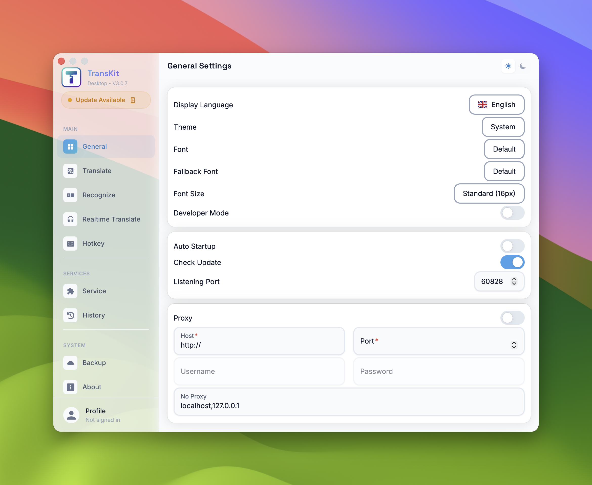
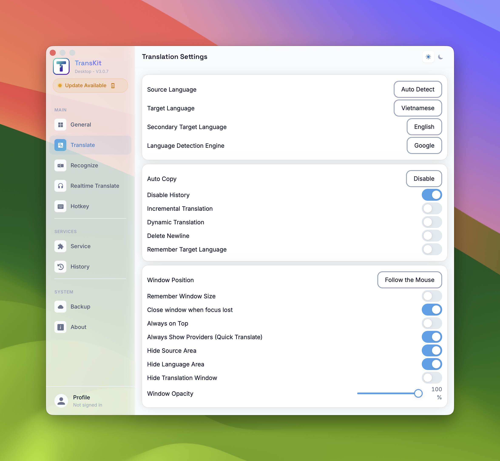
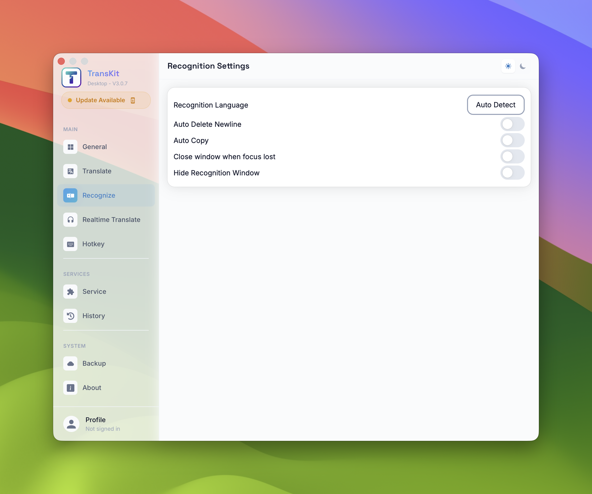
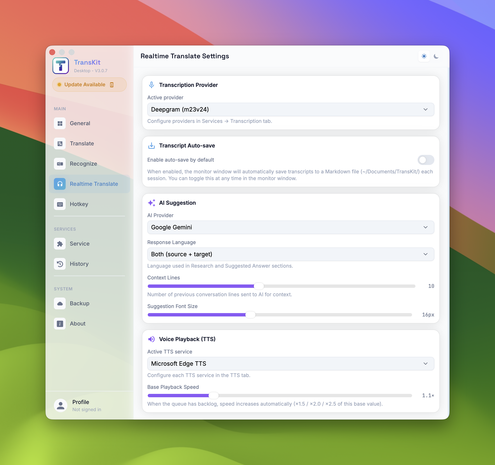
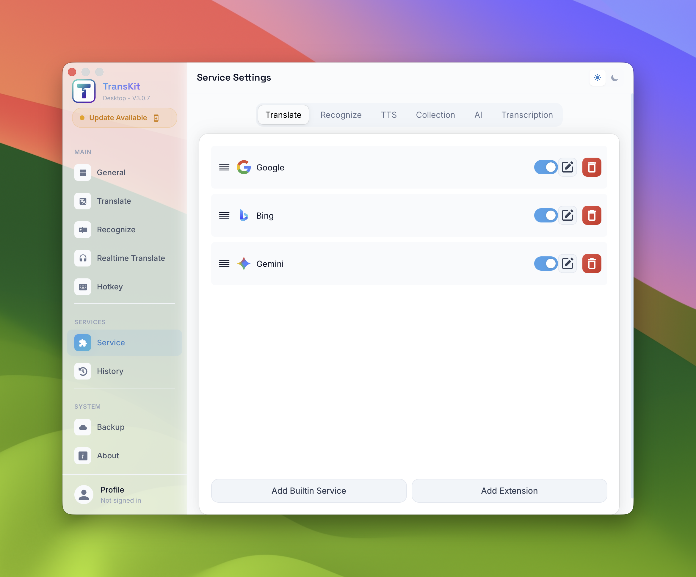
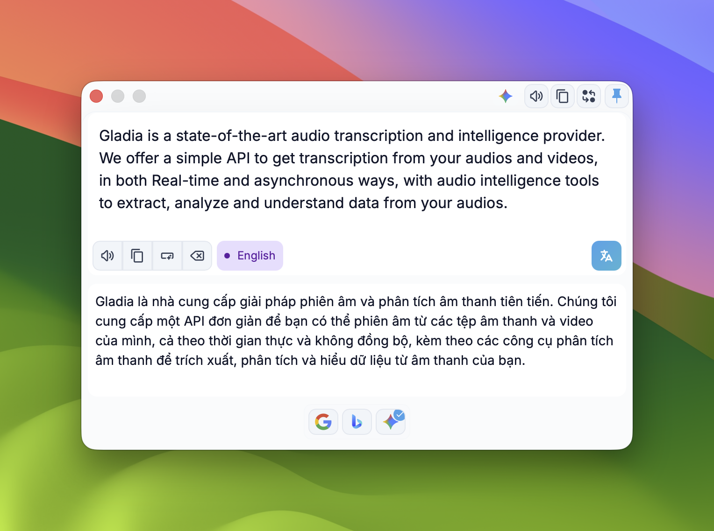
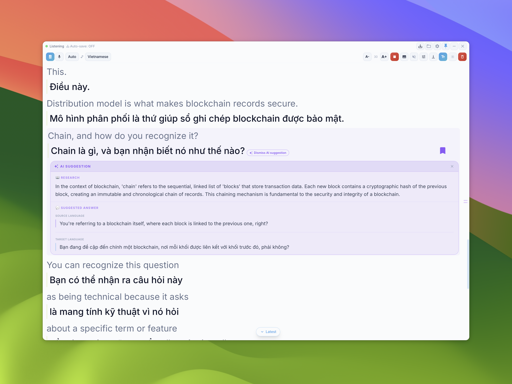

# Transkit User Guide

Welcome to **Transkit** - a powerful cross-platform translation, OCR, and realtime monitoring toolkit. This guide will help you understand the configuration and usage of each feature.

---
- [Tiếng Việt](./user_guide_vi.md)

## 0. Installation

### Windows
1. Download the latest `.exe` installer from the [Releases page](https://github.com/transkit-app/transkit-desktop/releases/latest).
2. Run the installer. If Windows Defender shows a "Windows protected your PC" message, click **"More info"** and then **"Run anyway"**.

### macOS
1. Download the latest `.dmg` from the [Releases page](https://github.com/transkit-app/transkit-desktop/releases/latest).
2. Open the `.dmg` and drag **TransKit** to Applications.
3. **Important** — the app is not yet signed with an Apple Developer certificate (pending enrollment approval). macOS will block it on first open. Run this command **once** in Terminal to allow it:
   ```bash
   xattr -cr /Applications/TransKit.app
   ```
   > This step will no longer be needed once code signing is in place.
4. Open **TransKit** from Applications.

#### Permissions (First time use)
The first time you open the app, macOS will ask for **Screen & System Audio Recording** permissions:
- Click **Open System Settings** when prompted.
- Find **TransKit** in the list.
- Toggle the switch to **ON**.
- macOS will require you to **Quit & Reopen** — click that button.
- *This permission is mandatory for the app to capture system audio from Zoom, Meet, Google, etc.*

---

## 1. System Configuration (Settings)

Settings is the control center for all application behaviors. You can access it via the settings icon to customize the following sections:

### 1.1. General Settings
Customize the interface and basic system settings.
- **Display Language**: The language of the application interface.
- **Theme**: Display mode (Light/Dark or System).
- **Font & Fallback Font**: Customize the font used in translation windows.
- **Font Size**: Text size (Default is 16px).
- **Developer Mode**: Toggle developer-specific features.
- **Auto Startup**: Automatically launch Transkit when you log into your computer.
- **Check Update**: Automatically check for new versions.
- **Listening Port**: The application's service port (Default: 60828).
- **Proxy**: Configure a proxy if you need to bypass network restrictions or speed up access to international services.



### 1.2. Translation Settings
Customize parameters related to the translation process.
- **Language**: Set Source, Target, and Secondary Target languages.
- **Language Detection Engine**: The engine used to automatically detect the source language (e.g., Google).
- **Auto Copy**: Automatically copy translation results to the Clipboard.
- **Disable History**: Choose not to save translation history.
- **Incremental/Dynamic Translation**: Translate instantly while you type.
- **Remember Target Language**: Save the last used target language for future sessions.
- **Window Position**: Where the translation window appears (Follow mouse or fixed position).
- **Window Opacity**: Adjust the transparency of the translation window.



### 1.3. Recognition Settings (OCR)
Configuration for text recognition from images.
- **Recognition Language**: The language to recognize (Auto or specified).
- **Auto Delete Newline**: Automatically remove line breaks from recognized text.
- **Close window when focus lost**: Automatically close the window when clicking elsewhere.



### 1.4. Realtime Translate Settings (Monitor)
Specifically for the Monitor feature, which translates audio from the system or Microphone in real-time.
- **Transcription Provider**: Select the service for speech-to-text (e.g., Deepgram, Soniox).
- **Transcript Auto-save**: Automatically save meeting transcripts to a Markdown file in `~/Documents/TransKit/`.
- **AI Suggestion**: Use AI (e.g., Google Gemini) to provide smart suggestions, summaries, or context-based explanations during a session.
- **Voice Playback (TTS)**: Configure voice and speed for reading translated text aloud.



### 1.5. Hotkeys
Set up key combinations to trigger features quickly:
- **Selection Translate**: Translate selected text.
- **Input Translate**: Open the input dialog for 2-way translation.
- **OCR Recognize**: Trigger screenshot for text recognition.
- **OCR Translate**: Trigger screenshot for direct image translation.
- **Audio Monitor**: Toggle the Realtime Audio Translation window.

### 1.6. Service (Providers)
Manage API keys and providers for each service type:
- **Translate**: Translation services (Google, Bing, Gemini, etc.).
- **Recognize**: OCR services (Tesseract, System, etc.).
- **TTS**: Text-to-speech services (Edge TTS, ElevenLabs, etc.).
- **AI**: AI providers for smart suggestions.
- **Transcription**: Speech-to-text services for the Monitor feature.
- **Collection**: Manage saved vocabulary or history.

---

## 2. Main Features

### 2.1. Smart Translation (Selection)
**Usage**: Select any text > Press the selection translate Hotkey.
- The translation window appears near your cursor.
- Shows results from multiple providers simultaneously for comparison.
- Quick actions: Copy, Speak (TTS), Pin window.



### 2.2. Direct Translation (Input)
**Usage**: Open via Hotkey or app menu.
- Manually enter text in the top box and get results in the bottom box.
- Supports flexible 2-way translation via the language switch button.



### 2.3. OCR Translation / Text Detection
**Usage**: Press the OCR Hotkey > Select an area of the screen.
- Transkit captures the area and processes it using OCR algorithms.
- Recognized text can be copied or translated immediately.


### 2.4. Realtime Audio Translation (Monitor)
A high-end feature for tracking conversations (meetings, videos, etc.) in real-time.
- **Start/Stop Button**: Begin or end audio listening.
- **Subtitle Mode**: A minimized overlay mode that shows a single line of scrolling subtitles—perfect for movies or meetings.
- **Logging**: All conversations are saved with Speaker IDs (if supported) and their translations.
- **AI Context**: A side panel displaying smart suggestions from AI based on the current conversation topic.



SubMode (Subtitle mode): A minimized overlay mode that shows a single line of scrolling subtitles—perfect for movies or meetings.


---
*Note: You need to configure API Keys for paid services in the **Service** tab to achieve the best translation and recognition quality.*
